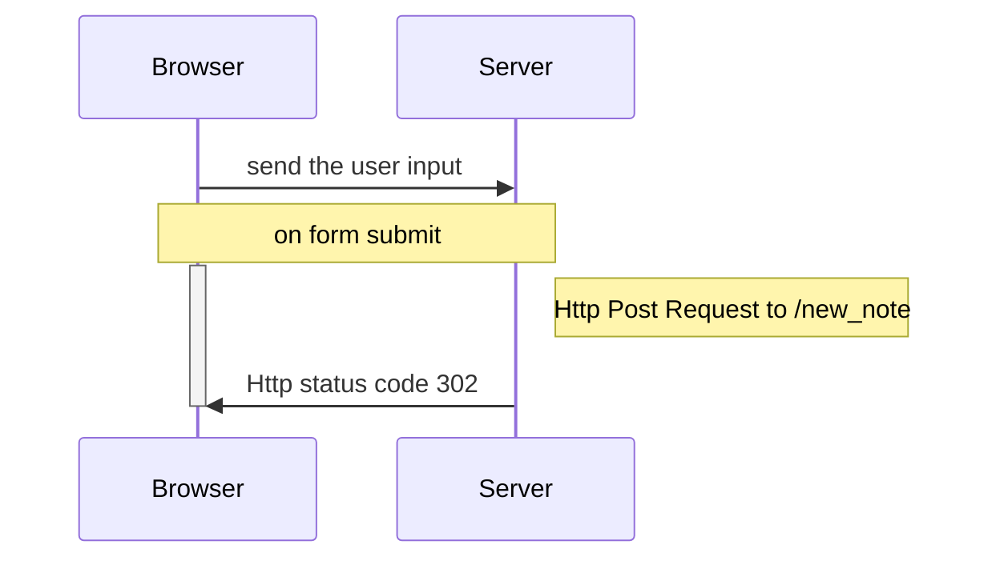

## Part 0.4 Fullstackopen 

```mermaid
sequenceDiagram;
participant Browser
participant Server

Browser ->> Server: send the user input
note over Browser, Server: on form submit
activate Browser
note right of Server: Http Post Request to /new_note
Server ->> Browser: Http status code 302
deactivate Browser

```
