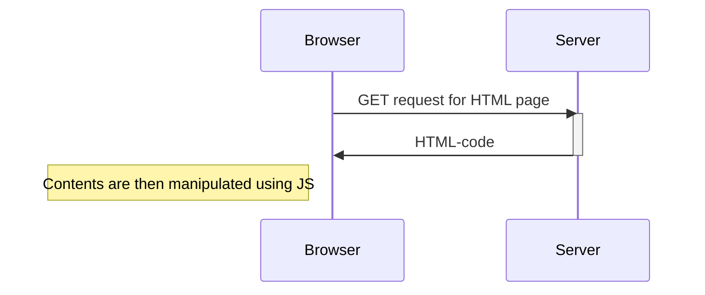

## Part 0.5 Fullstackopen

```mermaid
sequenceDiagram;
participant Browser
participant Server

Browser ->> Server: GET request for HTML page
activate Server
Server ->> Browser: HTML-code
deactivate Server
Note left of Browser: Contents are then manipulated using JS

```

